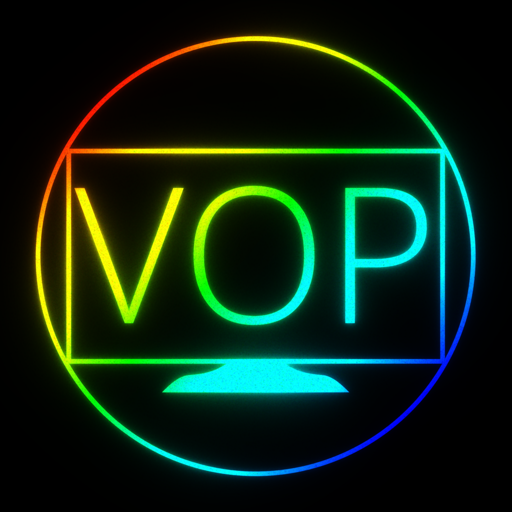

**Latest Stable:** v0.6.3 | **In Development:** v0.14.0
> [!IMPORTANT]
> **USE AT YOUR OWN RISK.** - This project is a learning experiment. If you brick your hardware, I cannot provide support outside of what has worked for me. Run this code only if you accept the risks of experimental software. And while this Flask Web application **CAN** be exposed on the public internet. I **HIGHLY** recommend doing it through a VPN instead if you want to reach it from outside.

---
# VOP

## Description
The VOP (Video Optical Printer) is a combination of hardware and software to make a tool that mimics several real world old tools used for animation, compositing and optical printing. 

### What does it aim to do?

In essence. In its simplest form. It takes an input image. And "projects" it onto an HDMI screen in a virtual 3D plane. And during a long exposure, the camera sensor records the light coming off that HDMI screen to a frame that's saved in a folder called CamMag. This image is saved as a 16 bit linear color tiff. And if you do another exposure and target that same tiff. The VOP will merge the two using additive mix. This additive workflow is named LIME (Latent Image Multiple Exposures) and is designed to mimic real world film workflows where exposing the frame in the camera to light adds it to the existing latent image.

This is all orchestrated with an exposure sheet to make a sequence of TIFFS or ProRes444. That sequence can then be moved to a desktop for further digital compositing and NLE work.

With the LIME system, the ability to bipack multiple 3D planes and the exposure sheet (three in total). You can achieve slitscan animation, compositing and optical image processing. And whatever the user dreams up within the VOP's capabilities.

### Who is this intended to be used by?
Mainly... me. I'm just putting this on a public repo in case someone out there with a madness similar to mine stumbles upon it and wants to explore this particular workflow.  

**In short. If you want to try out making video and motion graphics the way motion pictures used to make things before computers arrived. Then have a go with using the VOP.**

---

> [!NOTE]
> ## TLDR
>
> ### Technical Features
> - **16-bit Pipeline:** All processing is done in 16-bit linear color space for maximum math accuracy and dynamic range.
> - **Motion Blur:** Move artwork on-screen during exposure to create physical light smears.
> - **Smear:** Smear and extrude like an 80's title sequence.
> - **Virtual Gels & BiPacks:** Use digital mattes and color overlays to simulate traditional optical effects.
> - **Multiple Exposures:** To combine passes, the VOP uses LIME (see above).
> 
> ### Hardware needed:
> - **Raspberry Pi 5 or 4 (4GB+)** - The VOP is lightweight, typically using <1GB of RAM  
> - **Raspberry Pi Camera HQ** - (IMX477) with appropriate lens
> - **Storage with Raspberry Pi OS Lite (64 bit)** - SD card or USB3.2 Solid State Flash Drive. The faster, the better for handling the big TIFF files.
> - **HDMI Monitor** - Preferably an OLED (although the [black crush system](https://codeberg.org/jmalmsten-com/VOP/wiki/NoiseCrush) introduced in v0.6.3 helps a lot here for cheaper screens)
> - **Device for control** - the VOP is controlled with a web interface, pretty much any web browser works as long as it's on the same network. I recommend having the browser on a screen at at least 1920x1080.
> 
> ## Installation and use
> Check the Wiki for current instructions that should work. At least, it has worked for me. 
> - [wiki/tutorials](https://codeberg.org/jmalmsten-com/VOP/wiki/Tutorials_main)

# Contributing
Please report bugs or suggest improvements via **[ISSUES](https://codeberg.org/jmalmsten-com/VOP/issues)**. As this is a personal project, I will filter out what doesn't fit the intended workflow of the VOP, but I welcome suggestions, bug reports and solutions I have yet to think of!

**License:** This project is open-source under the [AGPL-3.0 License](LICENSE).

Copyright (c) 2025-2026 jmalmsten