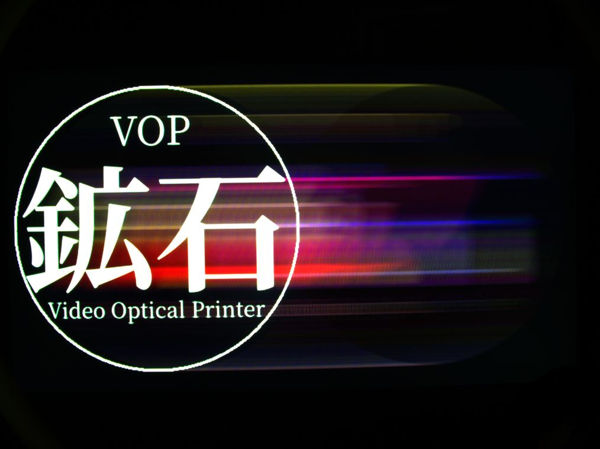

> [!DISCLAIMER]
> *USE AT YOUR OWN RISK.** This project is a learning experiment. If you brick your hardware, I cannot provide support. Run this code only if you accept the risks of experimental software.

---
# VOP

## Description
The VOP (Video Optical Printer) is a combination of hardware and software to make a tool that mimics several real world old tools used for animation, compositing and optical printing. 

### What does it aim to do?

In essence. In its simplest form. It takes an input image. And "projects" it onto an HDMI screen in a virtual 3D plane. And during a long exposure, the camera sensor records the light coming off that HDMI screen to a frame that's saved in a folder called CamMag. This image is saved as a 16 bit linear color tiff. And if you do another exposure and target that same tiff. The VOP will merge the two using additive mix. The system is called here LIME. (Latent Image Multiple Exposures)

This is all orchestrated with an exposure sheet to make a sequence. That sequence can then be moved to a desktop for further digital compositing and NLE work.

With the LIME system, the ability to bipack multiple 3D planes and the exposure sheet. You can achieve slitscan animation, compositing and optical image processing. And whatever the user dreams up within the VOP's capabilities.

### Who is this intended to be used by?
Mainly... me. I'm just putting this on a public repo in case someone out there with a madness similar to mine stumbles upon it and wants to explore this particular workflow. Also. I am also open for suggestions on how to make this work better without sacrificing the intended workflow. 

**In short. If you want to try out making video and motion graphics the way motion pictures used to make things before computers arrived. Then have a go with using the VOP.**

---

### Hardware needed:
- **Raspberry Pi 5 16GB** - The VOP uses less than a GB of RAM so a pi4 with 4GB should be plenty.  
- **Raspberry Pi Camera HQ** - (IMX477) with appropriate lens
- **SD card with Raspberry Pi OS Lite (64 bit)** - SD card or USB3.2 Solid State Flash Drive. The faster, the better for handling the big TIFF files.
- **HDMI Monitor** - Preferably an OLED (although the [black crush system](https://codeberg.org/jmalmsten-com/VOP/wiki/NoiseCrush) introduced in v0.6.3 helps a lot here for cheaper screens)
- **Tripod or gantry or something to line things up** - you'll want something steady to hold the camera, the pi and the HDMI monitor. You'll also want something that can be adjusted in all axes to line things up. 

## Installation and use
Check the Wiki for current instructions that should work. At least, it has worked for me. 
- [wiki/tutorials](https://codeberg.org/jmalmsten-com/VOP/wiki/Tutorials_main)

# Contributing
Please report bugs or suggest improvements via **Issues**. As this is a personal project, I will filter out what doesn't fit the intended workflow of the VOP, but I welcome suggestions, bug reports and solutions I have yet to think of!

**License:** This project is open-source under the [AGPL-3.0 License](LICENSE).

Copyright (c) 2025-2026 jmalmsten